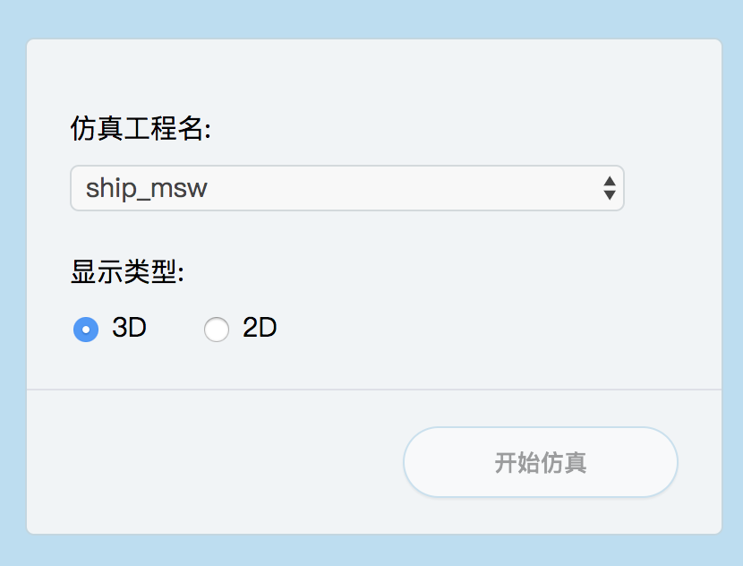
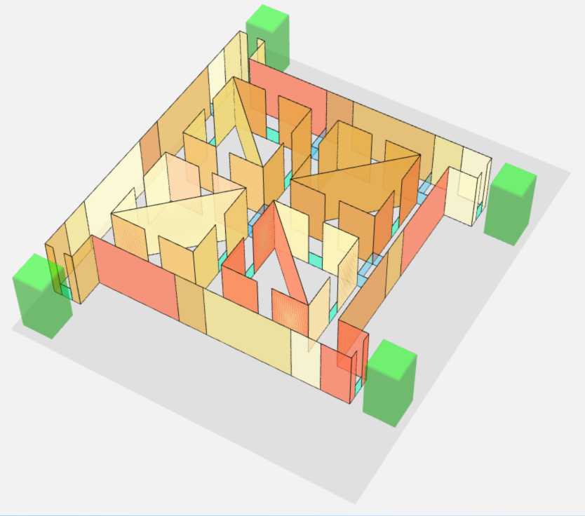
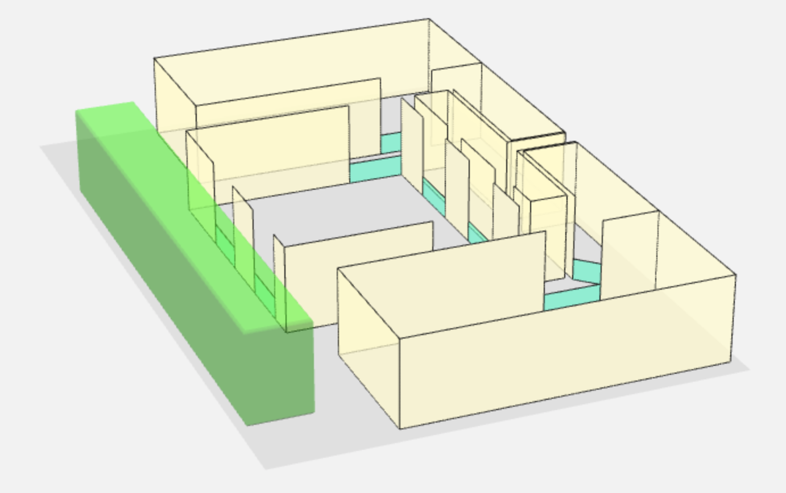
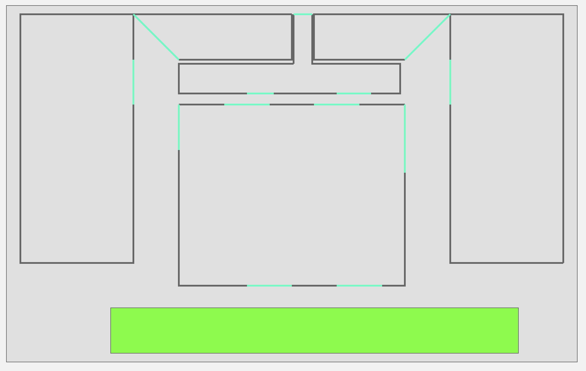

# 人群仿真web显示

## 系统要求

- python3
    - Flask

## 地图载入功能

- 启动 web 服务：`python app`，将会在本机的 8080 端口提供web服务
- 地图选择界面：在浏览器中输入`IP地址:8080`，如`localhost:8080`，即可进入地图选择界面

其中仿真工程名从 *simulations* 目录中读取，显示类型可以选择是以3d模式还是2d模式显示，点击开始仿真即可载入地图

地图支持 *Obstacle*、*Wall*、*transition*、*crossing* 的显示，其中 *Obstacle* 默认是闭合多边形，其他的都不闭合，另外3个的不同在于显示的颜色，*Wall* 不允许行人通过，*crossing* 为 *subroom* 之间的门，为显示为浅蓝色的实线， *transition* 为 *room* 之间及 *room* 与外界的门，显示为绿色的实线；goal 和障碍物一样时实体，其中final goal为绿色，middle goal 为浅蓝色。下面是几个例子：

- moscawa 3D

- moscawa 2D

- library 3D

- library 2D

