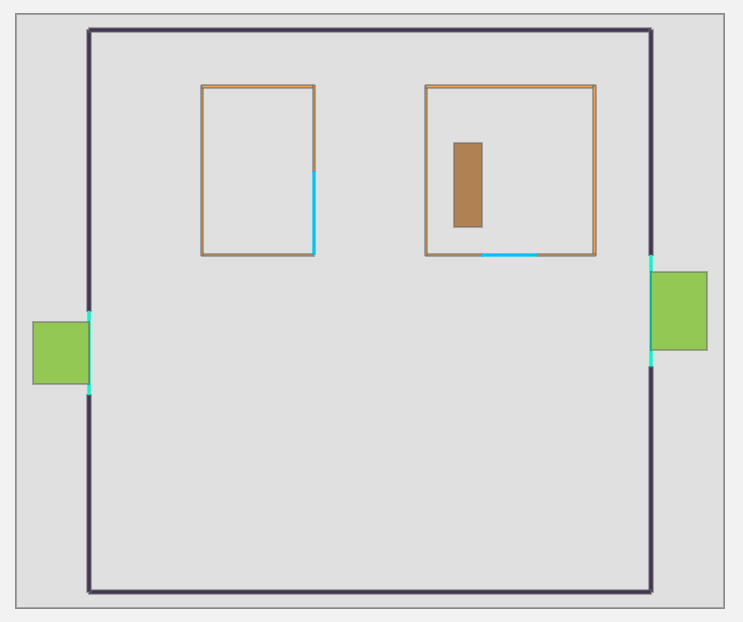
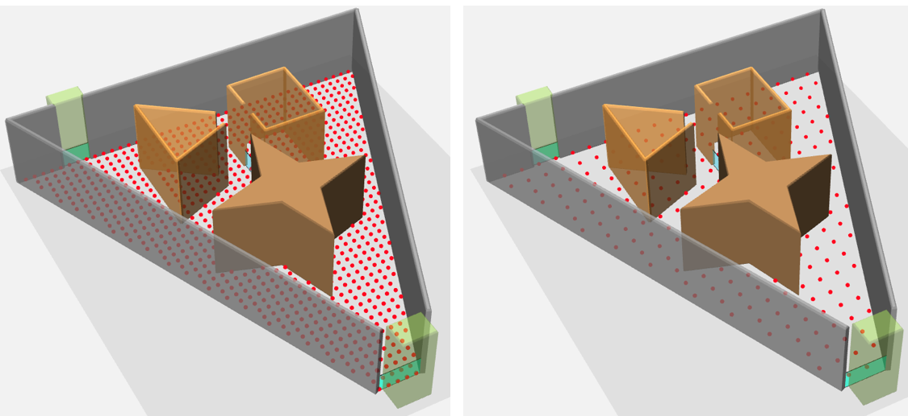

# 人群仿真web显示

**Author:** *Huabin Feng*  <br>  **Email:** *hbfeng@mail.ustc.edu.cn*

## 系统要求

- python3
    - Flask
    - matplotlib
    - flask-socketio


## 启动web服务

- 启动 web 服务：`python app`，将会在本机的 8080 端口提供web服务
- 地图选择界面：在浏览器中输入`IP地址:8080`，如`localhost:8080`，即可进入地图选择界面


其中仿真工程名从 *simulations* 目录中读取子文件夹，每个子文件夹代表一个仿真项目，包含仿真所需的所有信息，如地图信息、人群初始化信息，模型参数等。可以通过单选按钮选择显示类型，点击开始仿真即可载入地图。

## 地图效果

2D 地图的效果如下：



3D 地图的显示效果为：


说明：

- 深褐色为障碍物
- 浅蓝色为房间的出口
- 深绿色为建筑物的出口
- 浅绿色透明区域是安全区域，行人进入该区域及表示安全，并从地图中消失
- 其余对象为墙体

## 配置文件说明

上述显示的配置信息在 *simulations/demo1/ini.xml* 中，注意，一个仿真项目必须在 *simulations* 下有其对应的子文件夹，并且该子文件夹中必须有一个名为 *ini.xml* 的配置文件。配置文件格式为：
```xml
<?xml version="1.0" encoding="UTF-8" ?>

<CrowdSimulation>
    <!-- scale 用于缩放仿真场景，行人大小固定，调整场景大小可改变行人在场景中的显示大小 -->
    <!-- 因为 gridsize 用于确定行人分布目的，与行人相关，不受scale影响 -->
    <!-- gridsize 小于0.6的视为无效 -->
    <scene scale="1.0" gridsize="0.6">
        <!-- 设置相机位置，调整合适角度后通过浏览器终端的 map.getCameraPos() 获取 -->
        <!-- <camera x="0" y="0" z="-30"/> -->
    </scene>
    <geometry>
        <floor>
            <!-- 楼层的范围定义，由wall和transition构成
            其中的 vertex 必须有序，可以构成一个闭合多边形 -->
            <outwall>
                <wall>
                    <vertex px="-50" py="0"/>
                    ... ...
                </wall>
                <transition>
                    <vertex px="50" py="10"/>
                    ... ...
                </transition>
                ... ...
            </outwall>
            <!-- id 不一定是数字，可以是字符串 -->
            <room id="1">
                <wall>
                    <vertex px="20" py="10"/>
                    ... ...
                </wall>
                <crossing>
                    <vertex px="30" py="10"/>
                    ... ...
                </crossing>
                ... ...
            </room>
            <!-- 障碍物定义 -->
            <obstacle>
                <vertex px="15" py="15"/>
                ... ...
            </obstacle>
            <goals>
                <goal>
                    <vertex px="50" py="10"/>
                    ...
                </goal>
                ...
            </goals>
        </floor>
    </geometry>

    <!-- sum 为行人总数，真实的行人数不大于该值，不设置表示由其内部元素推导，
                inf表示使agent数量最大化 -->
    <agents sum="inf">
        <!-- 指定具体位置 (用的较少) -->
        <custom>
            <vertex px="0" py="0"/>
        </custom>
        <!-- 自动生成 -->
        <!-- 指定房间进行填充 inf表示使agent数量最大化-->
        <room roomid="1" count="5"/>
        <!-- 指定区域进行填充，inf表示使agent数量最大化 -->
        <area left="-10" bottom="-10" right="10" top="10" count="5"/>
    </agents>
</CrowdSimulation>
```
说明：

- `<geometry>` 中当前只能有一个 `<floor>`，后续扩展为多楼层同时仿真是允许多个
- `<floor>` 必须有且只能有一个 `<outwall>`
- `<outwall>` 中可以有多个 `<wall>` 和 `<transition>`
- `<floor>` 中允许有多个 `<room>`
- `<room>` 中允许有多个 `<wall>` 和 `<crossing>`
- `<floor>` 中允许有多个 `<obstacle>`
- `<floor>` 中必须有且只能有一个 `<goals>`
- `<goals>` 中至少要有一个 `<goal>`
- `<wall>`、`<transition>`、`<crossing>`、`<obstacle>`、`<goal>` 中只允许存在 `<vertex>`
- `<agents>`: 配置初始化行人的方式
    - `<custom>`: 手动指定行人初始位置，其中有多个 `<vectex>`
    - `<room>`: 指定某个room自动生成行人分布
    - `<area>`: 指定某个区域自动生成行人分布
- **地图的有效性需要用户保证，程序不进行地图错误检测**

*simulations/ini.xml* 是一个模板，用户可以在其之上进行修改。

### 配置参数的说明

- *scene* -> *scale* 属性： 该属性用于对模拟场景进行缩放。有时候我们定义的场景过大导致行人过小(行人默认为半径为0.25的圆)，如果要缩小场景需要缩小场景中每个对象的的每个坐标，工作量较大，scale属性即为缩放因子，通过程序将手动调节变为自动调节，下图为其效果：


左图为 *scale=1.0* 的结果，发现其中的行人(红点)太小，调整 *scale=0.3* 的效果如右图所示。

- *scene* -> *gridsize* 用于指定初始化行人位置时行人间的最小间距，设置 `<agents sum="inf">` 表示最大化行人数，然后调节 *gridsize* 查看效果：


其中左边为 `grid=1.2` 的情形，右边为 `grid=2.4` 的情形。当然，这些设置在3D场景中也是同样有效的。下面的两张图分别为对应的3D图。



### 行人初始化配置

行人初始化配置包括用户自定义与系统自动配置，下面是 *simulations/triangle-hall* 不同自动配置方式的效果：


左上图配置：
```xml
<agents>
    <room id="test1" count="inf"/>
    <room id="2" count="10"/>
    <area left="-22" bottom="13" right="-15" top="16" count="inf"/>
</agents>
```
右上图配置：
```xml
<agents sum="inf">
    <room id="test1" count="10"/>
    <room id="2" count="0"/>
    <area left="-22" bottom="13" right="-15" top="16" count="0"/>
</agents>
```
左下图配置：
```xml
<agents sum="20">
    <room id="test1" count="5"/>
    <room id="2" count="5"/>
    <area left="-22" bottom="13" right="-15" top="16" count="2"/>
</agents>
```
右下图：
```xml
<agents sum="20">
    <room id="test1" count="10"/>
    <room id="2" count="100"/>
    <area left="-22" bottom="13" right="-15" top="16" count="1"/>
</agents>
```

# 辅助操作

## map.LoadRoute

该函数是浏览器端调试模式使用的函数(chrome 按 F12 或者是 “右键”->“检查” 打开调试模式)，在 Console 中输入 `map.LoadRoute()` 即可显示路由信息，如下图所示，用箭头表示路由方向：


通过这种方式可以查看是否存在路由错误。

通过 `map.ClearRoute()` 可以清除路由信息。**注意：路由信息只有在 2D 场景下才可以显示。**


